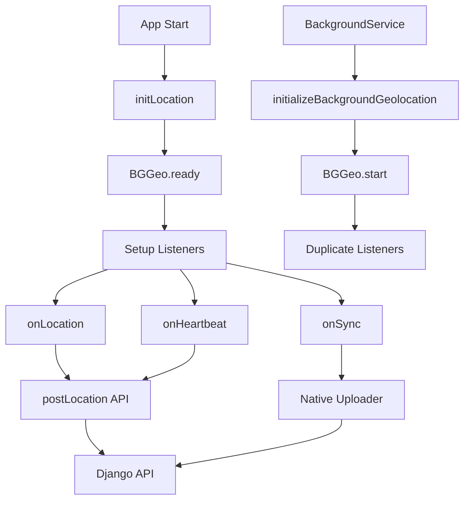

# Background Geolocation Audit Report

## 1. Overview

**Библиотека**: `react-native-background-geolocation` (Transistorsoft) v4.x  
**Единая точка инициализации**: ❌ НЕТ - множественные инициализации  
**Статус**: Сложная архитектура с дублированием и потенциальными проблемами стабильности

### Основные проблемы:
- Дублирование инициализации BGGeo в `location.js` и `backgroundService.js`
- Смешанная архитектура: собственные HTTP-вызовы + встроенный uploader
- Отсутствие единой точки управления состоянием
- Множественные таймеры и интервалы

## 2. Файлы и точки входа

### Основные файлы геолокации:
- **`src/location.js`** (941 строка) - основная инициализация BGGeo, обработчики событий
- **`src/services/backgroundService.js`** (543 строки) - дублирующая инициализация BGGeo
- **`src/config/geoConfig.js`** (61 строка) - конфигурация интервалов и точности
- **`src/config/geoEndpointConfig.js`** (75 строк) - переключение между API/webhook
- **`src/api.js`** - функция `postLocation()` для отправки геоданных
- **`src/services/geoService.js`** - локальное кэширование геоданных

### Точки входа:
1. **App.js** → `initLocation()` (строка 174 в location.js)
2. **MainScreen.js** → `startTracking()`/`stopTracking()` (строки 879-907)
3. **BackgroundService** → `initializeBackgroundGeolocation()` (строка 45)

## 3. Поток событий



### Псевдокод инициализации:
```javascript
// location.js:174
export async function initLocation() {
  // 1. Проверка разрешений
  // 2. Чтение лицензии из .env
  // 3. BGGeo.ready() с полной конфигурацией
  // 4. Регистрация обработчиков (onLocation, onHeartbeat, onSync)
  // 5. Регистрация headless task
  // 6. Запуск периодической отправки
}

// backgroundService.js:45
async initializeBackgroundGeolocation() {
  // ДУБЛИРОВАНИЕ: повторная инициализация BGGeo
  // Проверка состояния и запуск
}
```

## 4. HTTP-отправка

### Двойная архитектура отправки:

**1. Собственные HTTP-вызовы (основной путь):**
```javascript
// location.js:286-397 (onLocation)
// location.js:427-513 (onHeartbeat)
await postLocation({
  lat: c.latitude,
  lon: c.longitude,
  accuracy: c.accuracy,
  // ... другие поля
});
```

**2. Встроенный uploader BGGeo (настроен, но не используется):**
```javascript
// location.js:549-599
autoSync: true,
batchSync: true,
syncUrl: `${API_CONFIG.BASE_URL}/db_save/`,
syncThreshold: 1,
httpTimeout: 30000,
params: { api_token: API_CONFIG.API_TOKEN },
headers: { 'Authorization': `Bearer ${API_CONFIG.API_TOKEN}` },
transform: (location) => { /* трансформация данных */ }
```

### Поведение при оффлайне:
- **Собственные вызовы**: Нет обработки оффлайна, данные теряются
- **Встроенный uploader**: Настроен `maxRecordsToPersist: 1000`, но не используется

## 5. Права и манифесты

### Android (AndroidManifest.xml):
| Разрешение | Статус | Комментарий |
|------------|--------|-------------|
| `ACCESS_FINE_LOCATION` | ✅ | Есть |
| `ACCESS_COARSE_LOCATION` | ✅ | Есть |
| `ACCESS_BACKGROUND_LOCATION` | ✅ | Есть |
| `FOREGROUND_SERVICE` | ✅ | Есть |
| `POST_NOTIFICATIONS` | ✅ | Есть |
| `WAKE_LOCK` | ✅ | Есть |
| `RECEIVE_BOOT_COMPLETED` | ✅ | Есть |
| `REQUEST_IGNORE_BATTERY_OPTIMIZATIONS` | ✅ | Есть |

### iOS (Info.plist):
| Разрешение | Статус | Комментарий |
|------------|--------|-------------|
| `NSLocationWhenInUseUsageDescription` | ✅ | Есть |
| `NSLocationAlwaysAndWhenInUseUsageDescription` | ✅ | Есть |
| `UIBackgroundModes: location` | ✅ | Есть |

### Отсутствующие разрешения:
- ❌ `NSMotionUsageDescription` - для детекции движения
- ❌ `UIBackgroundModes: processing` - для фоновой обработки

## 6. Фон и живучесть

### Текущие настройки:
```javascript
// location.js:539-668
stopOnTerminate: false,        // ✅ Правильно
startOnBoot: true,             // ✅ Правильно  
enableHeadless: true,          // ✅ Правильно
foregroundService: true,        // ✅ Правильно
preventSuspend: true,          // ✅ Правильно (iOS)
heartbeatInterval: 10,         // ⚠️ Часто (10 сек)
```

### Проблемы:
- **Дублирование настроек**: `stopOnTerminate` и `startOnBoot` указаны дважды (строки 539, 611, 651)
- **Частый heartbeat**: 10 секунд может разряжать батарею
- **Отсутствие `requestIgnoreBatteryOptimizations()`**: не вызывается для Android

## 7. Настройки точности и батареи

### Текущие значения:
```javascript
// geoConfig.js:4-49
TEST_MODE: {
  DISTANCE_FILTER: 1,           // ⚠️ Очень часто (1 метр)
  HEARTBEAT_INTERVAL: 10,       // ⚠️ Часто (10 сек)
  STOP_TIMEOUT: 0,              // ✅ Не останавливается
  MAX_AGE: 2000,               // ✅ Свежие данные (2 сек)
}

PRODUCTION_MODE: {
  DISTANCE_FILTER: 1,           // ⚠️ Очень часто (1 метр)
  HEARTBEAT_INTERVAL: 10,       // ⚠️ Часто (10 сек)
  STOP_TIMEOUT: 0,              // ✅ Не останавливается
  MAX_AGE: 2000,               // ✅ Свежие данные (2 сек)
}
```

### Проблемы:
- **Слишком частые обновления**: 1 метр + 10 сек = высокая нагрузка на батарею
- **Одинаковые настройки**: TEST и PRODUCTION режимы идентичны

## 8. Дубли и анти-паттерны

### Критические проблемы:

**1. Множественные инициализации BGGeo:**
```javascript
// location.js:174 - основная инициализация
export async function initLocation() { /* ... */ }

// backgroundService.js:45 - дублирующая инициализация  
async initializeBackgroundGeolocation() { /* ... */ }
```

**2. Смешанная архитектура отправки:**
- Собственные HTTP-вызовы в `onLocation`/`onHeartbeat`
- Настроенный, но неиспользуемый встроенный uploader
- Дублирование логики отправки

**3. Множественные таймеры:**
```javascript
// location.js:770 - периодическая отправка
startPeriodicLocationSend() { setInterval(/* ... */) }

// backgroundService.js - собственные интервалы
this.intervalId = setInterval(/* ... */)
this.uploadIntervalId = setInterval(/* ... */)
```

**4. Отсутствие headless task в backgroundService:**
```javascript
// location.js:698 - headless task зарегистрирован
await BGGeo.registerHeadlessTask(async (event) => { /* ... */ });

// backgroundService.js - headless task НЕ зарегистрирован
// "Headless Task уже зарегистрирован в location.js" - комментарий
```

**5. Использование устаревших API:**
- ❌ Нет использования `navigator.geolocation` (хорошо)
- ❌ Нет использования `@react-native-community/geolocation` (хорошо)

## 9. ENV-переменные

### Читаемые переменные:
```javascript
// location.js:232-258
const platform = Platform.OS;
currentEnvVarName = platform === 'ios' ? 'BG_GEO_LICENSE_IOS' : 'BG_GEO_LICENSE_ANDROID';

// Чтение через react-native-config
const Config = require('react-native-config').default;
license = Config.BG_GEO_LICENSE_ANDROID || Config.BG_GEO_LICENSE_IOS;
```

### Fallback значения:
```javascript
// location.js:245-248
if (!license && Platform.OS === 'android') {
  license = '7d1976aa376fbcf7e40d12892c8dab579985abbcbc09e1da570826649b4295cf';
}
```

### Android build.gradle:
```gradle
// android/app/build.gradle:100-102
manifestPlaceholders = [
  BG_GEO_LICENSE_ANDROID: project.env.get("BG_GEO_LICENSE_ANDROID") ?: '7d1976aa376fbcf7e40d12892c8dab579985abbcbc09e1da570826649b4295cf'
]
```

## 10. Риски/симптомы «затуханий»

### Потенциальные причины остановки трекинга:

**1. Конфликт инициализаций (location.js:174 + backgroundService.js:45):**
- Два сервиса пытаются управлять одним BGGeo
- Возможны race conditions при старте/стопе

**2. Отсутствие обработки ошибок сети:**
```javascript
// location.js:380-382
} catch (error) {
  console.error(`Error sending location via postLocation API:`, error.message);
  // НЕТ повторных попыток или очереди
}
```

**3. Зависимость от активной смены:**
```javascript
// location.js:293-297
const hasActiveShift = await checkActiveShift();
if (!hasActiveShift) {
  console.log('onLocation suppressed: no active shift');
  return; // ОСТАНОВКА отправки
}
```

**4. Частые обновления разряжают батарею:**
- `distanceFilter: 1` метр
- `heartbeatInterval: 10` секунд
- Android может убить процесс для экономии батареи

**5. Отсутствие `requestIgnoreBatteryOptimizations()`:**
- Android Doze режим может заморозить приложение
- OEM-киллеры могут остановить фоновые сервисы

## 11. Список вопросов к автору

### Критические вопросы:

1. **Строка 45 в backgroundService.js**: Зачем дублируется инициализация BGGeo? Это создает конфликты.

2. **Строка 549 в location.js**: Почему настроен встроенный uploader, но используется собственная отправка через `postLocation()`?

3. **Строка 1 в geoConfig.js**: Почему TEST и PRODUCTION режимы идентичны? Нужны ли разные настройки?

4. **Строка 770 в location.js**: Зачем периодическая отправка, если есть `onLocation` и `onHeartbeat`?

5. **Строка 293 в location.js**: Что происходит, если API `/api/active-shift/` недоступен? Смена считается неактивной?

6. **Строка 245 в location.js**: Хардкодированная лицензия в коде - это нормально для продакшена?

### Технические вопросы:

7. **Строка 608 в location.js**: `preventSuspend: true` работает только на iOS. Нужна ли аналогичная настройка для Android?

8. **Строка 43 в AndroidManifest.xml**: Лицензия в манифесте совпадает с хардкодом в коде. Это правильно?

9. **Строка 36 в Info.plist**: Отсутствует `NSMotionUsageDescription`. Нужно ли для детекции движения?

10. **Строка 102 в api.js**: Почему `place_id: 1` и `phone_imei: "123456789012345"` хардкодятся?

## 12. Короткие рекомендации

### Минимальные изменения для стабилизации:

- **Убрать дублирование**: Удалить инициализацию BGGeo из `backgroundService.js`
- **Консолидировать отправку**: Использовать только встроенный uploader BGGeo
- **Увеличить интервалы**: `distanceFilter: 10`, `heartbeatInterval: 30`
- **Добавить обработку ошибок**: Retry логика для сетевых запросов
- **Вызвать `requestIgnoreBatteryOptimizations()`**: Для Android
- **Убрать периодическую отправку**: Использовать только события BGGeo
- **Разделить TEST/PRODUCTION**: Разные настройки для разных режимов
- **Добавить мониторинг**: Логирование состояния BGGeo и ошибок

### Приоритет исправлений:
1. 🔴 **Критично**: Убрать дублирование инициализации
2. 🔴 **Критично**: Консолидировать архитектуру отправки  
3. 🟡 **Важно**: Увеличить интервалы для экономии батареи
4. 🟡 **Важно**: Добавить обработку ошибок сети
5. 🟢 **Желательно**: Разделить конфигурации TEST/PRODUCTION
